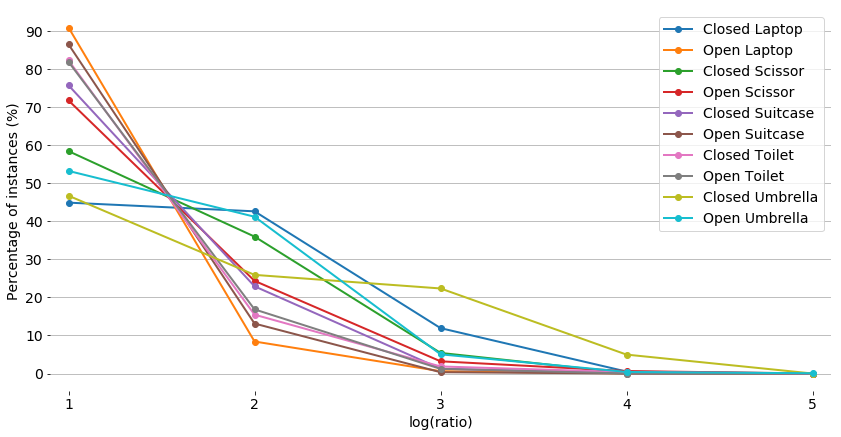

The script analyzes the **aspect ratio of bounding box** of objects in a detection dataset where annotation is in *PASCAL VOC format*.

- Values on x-axis: **log2(ratio)** where **ratio = longer side / shorter side** so that objects with similar aspect ratio (1:4,4:1) falls in to same category.
- Values on y-axis: **proportion of instances (%)** in each category that fall into each bin.

As it can be seen in the above graph most of objects in each category falls into first bin
indicating that mostly objects bounding box have aspect ratio of *1:2 or 2:1* in this dataset.

