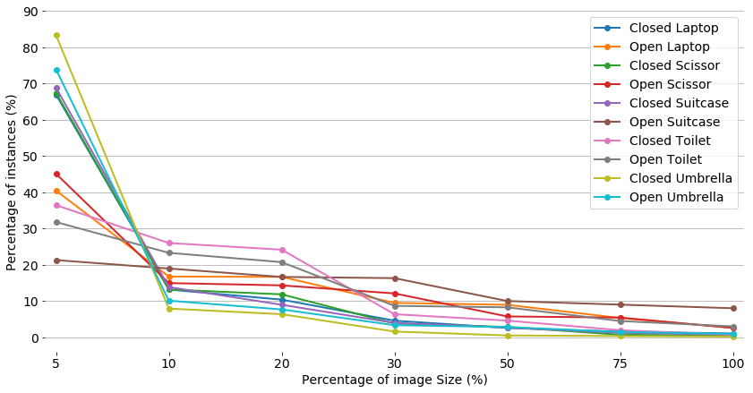

The script analyzes the objects **bounding size in detection dataset** where annotation is in *PASCAL VOC format*.

- Values on x-axis: **proportion of image area (%)** occupied by the objects
	- Categorized into bins: \&lt 5, 5-10, 10-20, 20-30, 30-50, 50-75, 75-100.
- Values on y-axis: **proportion of instances (%)** in each category that fall into each bin.

As it can be seen in the above graph most of objects in each category falls into first bin
indicating that mostly objects are **very small** in this dataset.

